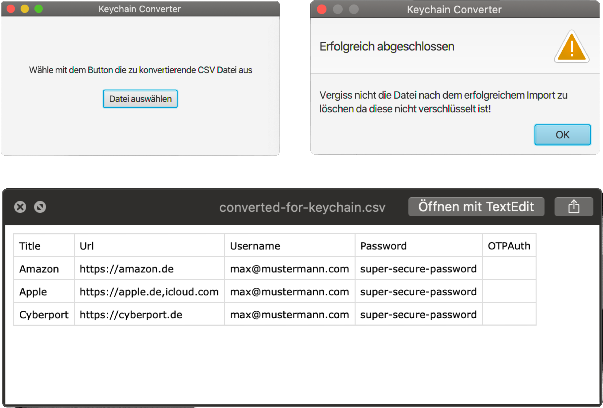

# Bitwarden to Keychain Converter

## Description
This application converts a Bitwarden CSV file to a CSV File that is importable by iCloud Keychain.  
The goal is to create a fast and lightweight application.

## Technologies
This Project is only using Java and Javafx for the GUI.  
The read and write process is supported by the library openCSV. 
For the Build-Management-Tool I chose Maven.

## Preview
Super simple GUI with different alerts if the user forgets to select a file or selects a wrong formatted file. 

